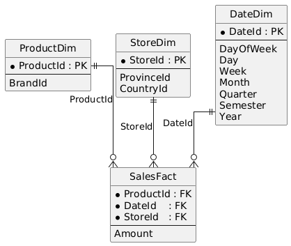

# Вопрос 1 (Session 6: OLAP) — схема и SQL:1999 datacube

## Реляционная схема (звезда)

### Dimension tables

`ProductDim(ProductId, BrandId, ...)`

`StoreDim(StoreId, ProvinceId, CountryId, ...)`

`DateDim(DateId, DayOfWeek, Day, Week, Month, Quarter, Semester, Year, ...)`

### Fact table

`SalesFact(ProductId, DateId, StoreId, Amount)`

Здесь `Amount` — исходная мера продаж (для `SUM` и `AVG`).  
`Average sales` считается как `AVG(Amount)` (т.е. не нужно хранить заранее среднее).



## SQL:1999 datacube (идея)

В SQL:1999 datacube можно получить через `GROUP BY CUBE` над ключами уровней иерархий.  
NULL в атрибутах результата интерпретируется как агрегация по соответствующей размерности.

Пример агрегатного запроса (каркас):

```sql
SELECT
  p.ProductId,
  p.BrandId,
  s.StoreId,
  s.ProvinceId,
  s.CountryId,
  d.Year,
  d.Quarter,
  d.Semester,
  d.Month,
  d.Week,
  d.DayOfWeek,
  SUM(f.Amount) AS TotalSales,
  AVG(f.Amount) AS AvgSales
FROM SalesFact f
JOIN ProductDim p ON p.ProductId = f.ProductId
JOIN StoreDim   s ON s.StoreId   = f.StoreId
JOIN DateDim    d ON d.DateId    = f.DateId
GROUP BY CUBE(
  p.ProductId, p.BrandId,
  s.StoreId, s.ProvinceId, s.CountryId,
  d.Year, d.Quarter, d.Semester, d.Month, d.Week, d.DayOfWeek
);
```

## Как обрабатывать несколько мер

В SELECT просто добавляются несколько агрегатных выражений по одной и той же мере `Amount`:
- `SUM(Amount)` — total sales
- `AVG(Amount)` — average sales

## Как обрабатывать иерархии

Иерархии задаются атрибутами в dimension-таблицах:
- Product level: `ProductId -> BrandId`
- Store level: `StoreId -> ProvinceId -> CountryId`
- Time level: `DayOfWeek/Day -> Week -> Month -> Quarter -> Semester -> Year`

`GROUP BY CUBE` генерирует все агрегаты по этим “размерам”, а NULL в выходе показывает, что по соответствующему уровню выполнена агрегация.

(На практике, если требуется строгая иерархическая консистентность только для “валидных roll-up уровней”, обычно используют `GROUPING SETS` с перечислением допустимых наборов уровней, но формально datacube выражается через `CUBE` как объединение таких агрегатов.)

